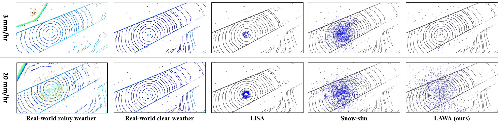
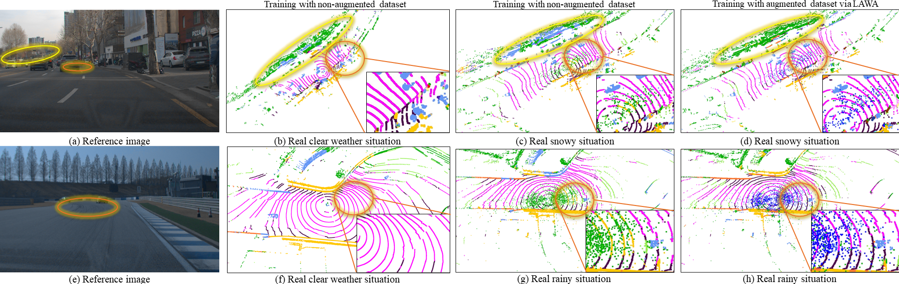
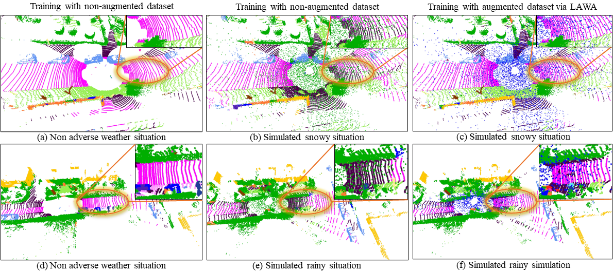

# LAWA: LiDAR Adverse Weather Augmentation for Robust Point Cloud Semantic Segmentation
LAWA: LiDAR Adverse Weather Augmentation for Robust Point Cloud Semantic Segmentation

coming soon...

## Demo

## Qualitative comparison of scatter points based on precipitation levels
Comparison with: 
- [[LISA](https://arxiv.org/abs/2107.07004)]: Kilic, Velat, et al. "Lidar light scattering augmentation (lisa): Physics-based simulation of adverse weather conditions for 3d object detection." arXiv preprint arXiv:2107.07004 (2021).
- [[Snow-sim](https://openaccess.thecvf.com/content/CVPR2022/html/Hahner_LiDAR_Snowfall_Simulation_for_Robust_3D_Object_Detection_CVPR_2022_paper.html)]: Hahner, Martin, et al. "Lidar snowfall simulation for robust 3d object detection." Proceedings of the IEEE/CVF Conference on Computer Vision and Pattern Recognition. 2022.

## Result of semantic segmentation using real world adverse weather dataset
- KONKUK Ailab dataset

- KITTI Dataset
